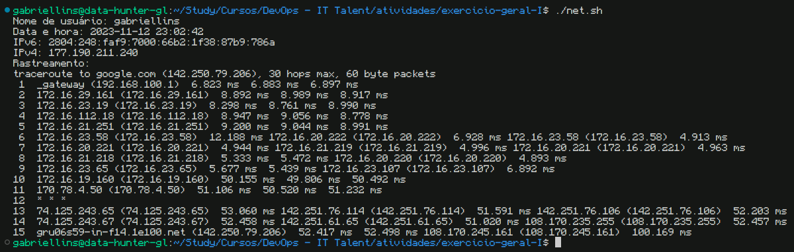

<h1>Curso de DevOps 2023.2 - IT Talent</h1>

<h2>Exercício Prático de Revisão em Linux, Shell Script, Redes, Git, Github e Docker</h2>

**Discente**: Gabriel Lins

---

<h2>Índice</h2>

- [Descrição da Atividade](#descrição-da-atividade)
- [Screenshots](#screenshots)
  - [Teste na máquina local (host)](#teste-na-máquina-local-host)

---

## Descrição da Atividade

1. Instalar o Docker na máquina, caso não o tenha
2. Criar repositório no Github
3. Criar um shell script que fará: 
  &emsp;3.1. Imprimir no console utilizando variável de ambiente o nome do usuário atual da máquina 
  &emsp;3.2. Imprimir a data e horário no formato Y-%m-%d %H:%M:%S" 
  &emsp;3.3. Usando o curl, imprima na tela o ip da máquina 
  &emsp;3.4. Usando um comando de “rastreamento” de rota, imprima na tela o rastreamento da rota entre a máquina e google.com 
  &emsp;3.5. Certifique-se de instalar o programas necessários (no script shell), caso a máquina não os tenha 
4. Fazer o Dockerfile de uma máquina Linux com esse script e com permissão para executar esse script
5. Clonar o repositório na sua máquina e executar o script
6. Tirar prints dos resultados e subir esses prints para o mesmo repo no github. 
  &emsp;6.1. O repositório deve estar público

A avaliação será feita pelos commits no github, você deve responder com o link para o repo.

---

## Screenshots

### Teste na máquina local (host)

